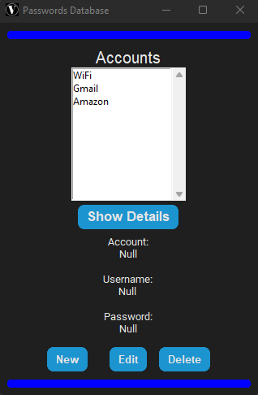
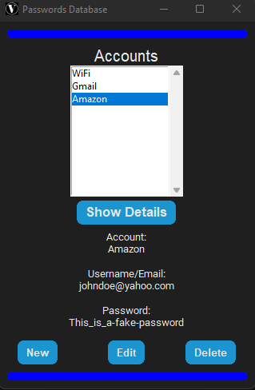
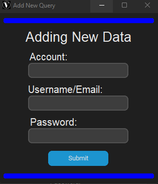
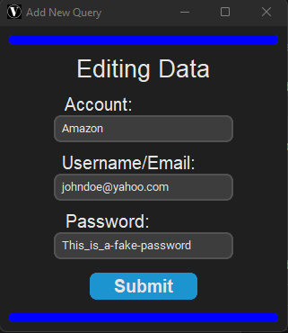

# password_gui
This is something I put together over a weekend for personal use and decided to add it here for anyone else. 

It's a pretty simple GUI that I think is pretty useful, i used 'customtkinter' tkinter from https://github.com/TomSchimansky/CustomTkinter

This is the front of the GUI and it displays the current password accounts you have and you click on one in the list box and hit the show details button and then
it adds the rest of the details to be displayed.

Adding the rest of the details to be seen

This is when you click the new button which opens up another window where you can add new information to the database.

The edit button works the same way as the new button does as in it opens up and new window that allows you to edit whatever entry you want to edit.

There is also a delete button that works the way you think it would work, it deletes a selected entry from both the listbox and the database.
I am using SqLite3 for the database.

